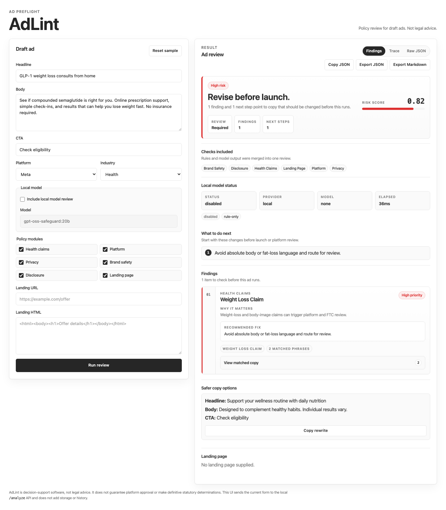

# 🛡️ AdLint

**Local-first preflight risk checks for ads, landing pages, and growth
campaigns before launch.**

AdLint is a runnable Python CLI/API MVP for deterministic ad policy,
brand-safety, privacy, and disclosure checks. It reviews ad copy and optional
landing-page content, then returns an explainable decision, risk score,
evidence, recommended actions, and safer rewrite suggestions.

AdLint is decision-support software, not legal advice. It does not guarantee
platform approval or make definitive statutory violation determinations.


## Why AdLint?

Ad review usually fails late: after creative is built, traffic is ready, or a
platform review blocks launch. Enterprise compliance tools can be opaque,
expensive, and hard to adapt to a team's actual growth workflow. Generic LLM
review is flexible, but often ungrounded and inconsistent.

AdLint takes a different path:

- **Local-first**: run checks without sending campaign copy to a hosted service.
- **Policy-as-code**: review logic lives in auditable YAML files.
- **Explainable**: every decision includes policy IDs, evidence, severities, and recommended actions.
- **Composable**: use it as a CLI, FastAPI service, importable Python engine, or local Web UI.
- **Benchmark-oriented**: eval datasets, policy coverage, and blind holdout diagnostics are first-class.
- **Legally careful**: AdLint flags review risk; it does not promise compliance or platform approval.

AdLint is for growth teams that want a preflight check before legal/platform
review, not a black-box replacement for reviewers.

## Demo surfaces

AdLint currently has three demo-friendly entry points:

1. **CLI** — scan a JSON/YAML campaign config and write JSON/Markdown reports.
2. **Batch CLI** — review a CSV of campaign rows and export a local archive.
3. **Local Web UI** — paste copy, configure platform/industry/model settings, review findings, and export reports.
4. **FastAPI** — embed `/analyze` into internal tools or CI workflows.



The demo intentionally uses risky health/weight-loss copy so the review surface
shows matched evidence, recommended actions, and safer rewrite suggestions.
Risk scores are heuristic decision-support signals, not compliance guarantees.

Example generated reports:

- [`docs/assets/demo/adlint-report.md`](docs/assets/demo/adlint-report.md)
- [`docs/assets/demo/adlint-report.json`](docs/assets/demo/adlint-report.json)

Reproduce the CLI demo:

```bash
adlint scan examples/meta_high_risk_health.json --format markdown --output-dir docs/assets/demo
make api  # then open http://127.0.0.1:8000/ui/
```

## What runs today

- Python package with the `adlint scan` CLI.
- `adlint batch` for CSV preflight review with local JSON, CSV, and Markdown
  summary exports.
- FastAPI app with `GET /health`, `GET /models`, `POST /analyze`, and
  `POST /eval`.
- One-page Web UI at `/ui/` for the main local review workflow, including
  model selection and opt-in Local model review controls with timeout recovery.
- YAML policy files under `adlint/policies/`, plus custom policy paths.
- Deterministic rule engine with policy-module, platform, and industry filters,
  including `platform: "all"` for broad cross-platform preflight checks.
- Transparent score thresholds for `approved`, `needs_review`, and `high_risk`.
- Optional `scoring.yml` threshold and weight overrides for team calibration.
- JSON stdout, Markdown stdout, and paired JSON/Markdown report files.
- Safer rewrite suggestions for high-risk and review-required findings.
- Metadata-only `creative_assets` placeholders for image/video review inputs.
  Supplied OCR or transcript excerpts can run through text rules, while raw
  media is not read or stored by default.
- Opt-in JSONL run logging for local evaluation workflows.
- Opt-in SQLite metadata storage for scan summaries and eval scores.
- Seed, benchmark, public-source real-case, and blind web-sourced eval runners.
- Tests covering the CLI, API, policy loading, reports, documented examples,
  eval runner, and opt-in logging behavior.
- Makefile and Docker Compose paths for local development.

## Not in this MVP yet

- A statistically representative production benchmark; the current 75-row
  public-source set and 90-row blind holdout are balanced and useful for
  diagnostics, but still curated rather than randomly sampled production
  traffic.
- Durable raw submission storage. Raw ad copy and landing-page submissions are
  not persisted by default, and optional SQLite storage is metadata-only.
- Playwright or trafilatura extraction. The current landing-page extractor is
  a small stdlib HTML parser that can read inline HTML, local files, or
  fetchable HTML URLs.
- Native image/video analysis. Creative asset metadata can be attached to
  reports and supplied text metadata can be checked by text rules, but AdLint
  does not yet run OCR, frame analysis, speech-to-text, or visual policy checks.
- Fine-tuning. Local model support is available for decision support, but
  deterministic rules are the production baseline until live evals prove
  incremental value.

## Quick start

Requirements: Python 3.11 or newer. Docker is optional.

```bash
python3 -m venv .venv
. .venv/bin/activate
python -m pip install -e ".[dev]"
adlint scan examples/high_risk_tiktok_health.json --output-dir reports
```

Without activating the virtual environment:

```bash
.venv/bin/python -m adlint scan examples/high_risk_tiktok_health.json \
  --format markdown
```

Makefile shortcuts:

```bash
make dev   # install and run the high-risk example, writing reports/
make scan  # install and run the wellness example
make api   # start uvicorn with adlint.api:app
make eval  # run the seed evals and write evals/results/latest.json
make benchmark    # run the 213-row synthetic policy regression benchmark
make policy-coverage           # refresh docs/policy_coverage_matrix.md
make policy-coverage-validate  # check the committed coverage matrix
make rewrite-quality # run the deterministic rewrite-quality rubric eval
make pr-preflight # verify generated eval assets before opening an eval PR
make real-cases   # run balanced public-source real-case diagnostics
make real-cases-ci # run the strict real-case CI gate
make real-cases-model-quality  # run the live local-model quality comparison
make real-world-blind           # run blind web-sourced holdout diagnostics
make real-world-blind-ci        # run the conservative blind holdout CI gate
make real-world-blind-model-quality  # run live model quality on the blind holdout
make research-summary # print compact JSON summaries for research loops
make test  # run pytest
```

Docker Compose runs the bundled scan example and writes reports:

```bash
docker compose up
```

## CLI

```bash
adlint scan <config>
```

`<config>` can be JSON or YAML. Supported options:

- `--format json|markdown` controls stdout output. The default is JSON.
- `--output-dir <dir>` writes `adlint-report.json` and `adlint-report.md`.
- `--policy-path <path>` loads a policy YAML file or directory. Pass it more
  than once to combine paths.
- `--scoring-config <path>` loads optional threshold and weight overrides,
  typically from `scoring.yml`.
- `--enable-model` calls the local Ollama-compatible classifier for
  metadata-only review notes.
- `--model-affects-score` lets valid model findings join `policy_hits` and
  affect scoring. This is off by default.
- `--ollama-model <name>` overrides `ADLINT_OLLAMA_MODEL`.
- `--enable-storage` writes metadata-only SQLite scan storage.
- `--storage-path <path>` sets the SQLite metadata database path and opts into
  storage.

Example config:

```json
{
  "platform": "tiktok",
  "country": "US",
  "industry": "health",
  "headline": "Lose 20 pounds in 30 days guaranteed",
  "body": "Our clinically proven supplement melts fat fast.",
  "cta": "Buy now",
  "landing_page_html": "<html><body><h1>Fast results</h1></body></html>",
  "policy_modules": ["health_claims", "platform", "privacy"]
}
```

Optional input fields include `target_age_range`, `landing_page_url`,
`creative_assets`, `model_enabled`, `model_affects_score`, `ollama_model`,
`logging_enabled`, `log_path`, `storage_enabled`, and `storage_path`.

### Creative asset metadata

Use `creative_assets` to attach private, metadata-only placeholders for image,
video, audio, display, or HTML5 assets. AdLint does not read the raw file, store
the local path, run OCR, or claim visual policy coverage. If you already have
OCR text, transcript snippets, alt text, or labels from a local workflow, pass
those fields so the existing text rules can inspect them:

```json
{
  "platform": "tiktok",
  "industry": "health",
  "headline": "Daily wellness routine",
  "body": "A simple guide for planning healthy habits.",
  "cta": "Learn more",
  "creative_assets": [
    {
      "asset_id": "hero-image",
      "asset_type": "image",
      "path": "/private/campaigns/hero.png",
      "mime_type": "image/png",
      "width": 1080,
      "height": 1080,
      "text_overlay": "Lose 20 pounds in 30 days guaranteed"
    }
  ]
}
```

Reports include sanitized asset metadata such as `filename`, dimensions, media
type, and booleans showing which text metadata fields were supplied. Batch
summaries omit the `creative_assets` column by default; per-row reports remain
local when `--output-dir` is used.

Use `platform: "all"` when you want one broad preflight pass across the
platform-scoped policy modules AdLint currently ships. This is useful for early
creative review before a channel is final, but it is not a platform-parity
claim; use a specific platform value such as `google`, `meta`, `tiktok`, or
`linkedin` when checking channel-specific launch risk.

### Batch CSV review

Use `adlint batch` when you want to preflight a small campaign set without
uploading raw creative to a hosted service:

```bash
adlint batch examples/batch_campaigns.csv --output-dir reports/batch
```

CSV columns map to the same fields as the scan config, including `platform`,
`industry`, `headline`, `body`, `cta`, `landing_page_url`,
`landing_page_html`, `creative_assets`, and `policy_modules`. Use a JSON array
for `creative_assets`. Separate multiple policy modules with `;`, `,`, or `|`.

With `--output-dir`, AdLint writes:

- `adlint-batch-summary.json`
- `adlint-batch-summary.csv`
- `adlint-batch-summary.md`
- one JSON and one Markdown report per row

The batch summary intentionally omits raw ad copy and landing-page HTML. Per-row
reports stay local and contain the evidence snippets needed for review.

## Scoring configuration

By default, AdLint uses the built-in MVP scoring weights and thresholds. To
calibrate sensitivity for a team or eval run, pass a `scoring.yml` file:

```bash
adlint scan examples/high_risk_tiktok_health.json \
  --scoring-config scoring.yml
```

All fields are optional; omitted fields keep the built-in defaults. Values must
be numbers from `0.0` to `1.0`, thresholds must be ordered, and severity weights
must stay ordered from `low` through `critical`.

```yaml
thresholds:
  needs_review: 0.35
  high_risk: 0.70
  max_without_high_severity: 0.69
weights:
  severity:
    low: 0.20
    medium: 0.40
    high: 0.70
    critical: 0.90
  evidence_count:
    per_item: 0.02
    max: 0.12
  regulated_category: 0.08
  landing_page_mismatch: 0.08
  privacy_tracking: 0.10
  brand_safety: 0.05
regulated_industries:
  - health
  - wellness
  - finance
```

Library callers can pass either `scoring_config_path="scoring.yml"` or a parsed
`scoring_config` mapping to `adlint.engine.analyze`.

## API

Start the API:

```bash
make api
```

Open the local UI:

```text
http://127.0.0.1:8000/ui/
```

Endpoints:

- `GET /health` returns service status.
- `GET /models` returns local model configuration and available model choices
  for the Web UI.
- `POST /analyze` accepts the same payload shape as the CLI config and returns
  the full analysis result.
- `POST /eval` accepts `{"examples": [...]}` where each example can include an
  `input` object and optional `expected_decision`.

The Web UI starts in rule-only mode. Users can opt into Local model review, and
separately opt into score impact. The model selector is populated from local
Ollama tags when available, filters obvious embedding-only models, and falls
back to known review-model options. API callers can omit `model_enabled` or set
it to `false` for a rule-only run, set `model_enabled: true` for metadata-only
model notes, or set `model_affects_score: true` when valid model findings
should join `policy_hits` and affect the final score. `ollama_model` overrides
`ADLINT_OLLAMA_MODEL` for that request.

Minimal request:

```bash
curl -s http://127.0.0.1:8000/analyze \
  -H 'content-type: application/json' \
  -d '{
    "platform": "google",
    "industry": "wellness",
    "headline": "A calmer routine for better sleep",
    "body": "Join our wellness newsletter for science-backed tips.",
    "cta": "Sign up"
  }'
```

## Output

Analysis results include:

- `decision`: `approved`, `needs_review`, or `high_risk`.
- `risk_score`: numeric score from `0.0` to `1.0`.
- `policy_hits`: policy IDs, severity, category, evidence, and actions.
- `requires_review`: true when a finding or score needs human review.
- `recommended_actions`: de-duplicated action list.
- `safer_rewrites`: deterministic rewrite suggestions.
- `landing_page`: extracted title, headings, claims, forms, pricing,
  disclaimers, trackers, or fetch errors.
- `enabled_modules`, `model`, `logging_enabled`, and optional `reports`.
  The `model` object includes status, schema validation metadata, score-impact
  mode, and metadata-only `findings` when local model review is enabled.

Report files use fixed names:

```text
adlint-report.json
adlint-report.md
```

## Policies

Bundled policies live in `adlint/policies/`:

- `ftc_health_claims.yml`
- `platform_google_ads.yml`
- `platform_meta_ads.yml`
- `platform_tiktok_ads.yml`
- `platform_linkedin_ads.yml`
- `privacy_hipaa_marketing.yml`
- `privacy_tracking_pixels.yml`
- `privacy_consumer_health_data.yml`
- `brand_safety_iab.yml`
- `brand_custom_template.yml`

Default modules are `health_claims`, `platform`, `privacy`, `brand_safety`,
`disclosure`, and `landing_page`. Pass `policy_modules` in a config to narrow
the rule surface.

Policy files use a top-level `policies` list:

```yaml
policies:
  - id: unsupported_health_claim
    severity: high
    category: health_claims
    description: Health or wellness claim likely requiring substantiation.
    modules: [health_claims]
    industries: [health, wellness]
    signals:
      - clinically proven
      - medical breakthrough
    recommended_action: Remove or qualify the claim and provide substantiation.
    requires_review: true
    rewrite_strategy: qualify_claim
```

## Evals and logging

Run the seed evals:

```bash
make eval
```

The seed dataset has 58 examples across health, wellness, finance, SaaS,
creator disclosure, privacy, landing-page mismatch, brand-safety, and Meta
platform-policy cases. It is a development sanity check, not a production
benchmark. The current PR #16-era local validation baseline is 1.000 decision
accuracy with no policy/category false-positive or false-negative notes.

Run the larger deterministic benchmark:

```bash
make benchmark
```

The synthetic policy regression benchmark currently has 213 examples and is
intended to catch deterministic rule regressions before release work.

Refresh or validate the policy coverage matrix:

```bash
make policy-coverage
make policy-coverage-validate
```

The matrix is a coverage inventory for policy ids across seed, benchmark, and
real-case datasets. It is not a quality or reliability metric.

Run the deterministic rewrite-quality rubric separately from decision
accuracy:

```bash
make rewrite-quality
```

The rewrite eval uses `evals/datasets/rewrite_quality_v1.jsonl` annotations
for clarity, risk reduction, policy fit, and intent preservation. It reports a
`rewrite_quality` section and marks `decision_accuracy` as not measured.
Deterministic rewrites remain the baseline before any model-generated rewrites
are introduced.

Run the public-source real-case diagnostics:

```bash
make real-cases
make real-cases-ci
```

`real_cases_v1` contains 75 paraphrased, source-backed rows balanced across 25
approved, 25 needs-review, and 25 high-risk expected decisions. It is useful
production-reliability diagnostic coverage, but it is still curated and does
not prove legal compliance or platform approval. The CI target requires 1.000
rule-only decision accuracy to catch deterministic regressions.

Run the full live local-model comparison against those same rows:

```bash
make real-cases-model-quality
```

This target requires the configured local Ollama-compatible model to be
available. By default it uses `gpt-oss-safeguard:20b`; override
`MODEL_EVAL_FLAGS` to test another installed model.

Run the blind web-sourced holdout:

```bash
make real-world-blind-candidates
make real-world-blind
make real-world-blind-ci
make real-world-blind-model-quality
```

`real_world_blind_v1` contains 90 accepted paraphrased public-source rows
balanced across 30 approved, 30 needs-review, and 30 high-risk expected
decisions. It is marked as a rule-tuning holdout and should be used to measure
generalization before changing deterministic rules. The CI gate uses a 0.90
decision-accuracy threshold against the current 0.967 post-triage rule-only
baseline.

Before opening eval/reliability PRs, run:

```bash
make pr-preflight
```

This confirms generated eval scripts and datasets are tracked and that the
committed real-case and blind holdout datasets match their generators. Live
local-model quality runs remain manual or scheduled diagnostics; deterministic
rules remain the production baseline.

Raw submissions are not persisted by default. To opt into JSONL logging, set:

```json
{
  "logging_enabled": true,
  "log_path": "logs/adlint-runs.jsonl"
}
```

SQLite metadata storage is separate and opt-in:

```json
{
  "storage_enabled": true,
  "storage_path": "logs/adlint-metadata.sqlite3"
}
```

Inspect or initialize the schema:

```bash
python -m adlint.storage schema
python -m adlint.storage init logs/adlint-metadata.sqlite3
```

Privacy guarantee: SQLite stores scan metadata only: platform, country,
industry, decision, risk score, review flag, policy IDs/categories/severity
counts, enabled modules, model metadata, logging flag, and report paths. It
does not store headline, body, CTA, landing-page URL, landing-page HTML,
evidence text, or rewrite text. Rewrite eval storage uses separate eval tables
and stores only row IDs, aggregate scores, per-dimension scores, pass flags,
and failure-code labels, not dataset inputs or generated rewrites.

## Local model hook

AdLint keeps deterministic rules as the trusted baseline. When local model
review is enabled, the Ollama-compatible model returns structured
decision-support metadata and metadata-only findings. Those findings do not
affect the final decision or risk score unless the caller explicitly enables
score impact with `--model-affects-score` or `model_affects_score: true`.

```bash
ollama pull gpt-oss-safeguard:20b
ADLINT_OLLAMA_MODEL=gpt-oss-safeguard:20b \
  adlint scan examples/high_risk_tiktok_health.json --enable-model
```

The default Ollama endpoint is `http://localhost:11434/api/chat`. Set
`ADLINT_OLLAMA_URL` to point AdLint at a different Ollama-compatible chat
endpoint. `ADLINT_OLLAMA_TIMEOUT` bounds generation time, and
`ADLINT_OLLAMA_NUM_PREDICT` can cap model output length for slower local
models or eval runs.

AdLint sends deterministic local classifier calls with JSON formatting,
`temperature: 0`, and `think: false` where supported, so reasoning chatter is
less likely to break the strict response schema. Fenced or wrapped JSON is
accepted when the enclosed object validates.

If the model endpoint is unavailable or a browser request times out, AdLint
still returns rule-based findings when possible and marks the model status as
`unavailable`.

Invalid model JSON or schema violations are marked `invalid_response` and are
ignored for scoring. Landing-page excerpts are treated as untrusted evidence in
the model prompt, not as instructions.


## Contributing

Contributions are welcome, especially policy rules, synthetic eval cases,
platform-specific examples, documentation, and tests for edge cases. Start with
[`CONTRIBUTING.md`](CONTRIBUTING.md) and the issue templates.

High-value contribution areas:

- Deeper Meta Ads parity, including additional restricted verticals and placement-specific cases.
- More public-source/paraphrased eval cases.
- Landing-page extraction improvements.
- Safer rewrite-quality evaluation.
- Docs, examples, screenshots, and launch polish.

## Related docs

- `docs/open_source_goal.md`
- `docs/release_v0.1.0.md`
- `docs/announcement_draft.md`
- `docs/policy_design.md`
- `docs/meta_ads_scope.md`
- `docs/legal_disclaimer.md`
- `docs/local_models.md`
- `docs/eval_report.md`
- `docs/policy_coverage_matrix.md`
- `docs/research_paper.md`
- `docs/adlint_hybrid_eval_paper.tex`

## Non-goals

AdLint does not aim to:

- Guarantee platform approval.
- Provide legal advice or replace counsel.
- Make definitive HIPAA, FTC, state privacy, or other statutory findings.
- Store PHI or user-level customer data by default.
- Submit ads to platforms or mutate live ad accounts.
- Fine-tune models before stronger eval evidence exists.

## References

- [OpenAI gpt-oss-safeguard](https://openai.com/index/introducing-gpt-oss-safeguard/)
- [OpenAI gpt-oss](https://openai.com/index/introducing-gpt-oss/)
- [HHS tracking technologies guidance](https://www.hhs.gov/hipaa/for-professionals/privacy/guidance/hipaa-online-tracking/index.html)
- [FTC health products compliance guidance](https://www.ftc.gov/business-guidance/resources/health-products-compliance-guidance)
- [FTC Health Breach Notification Rule](https://www.ftc.gov/tips-advice/business-center/guidance/complying-ftcs-health-breach-notification-rule)
- [Washington My Health My Data Act guidance](https://www.atg.wa.gov/protecting-washingtonians-personal-health-data-and-privacy)
- [California CCPA](https://oag.ca.gov/privacy/ccpa)
- [IAB Content Taxonomy](https://iabtechlab.com/standards/content-taxonomy/)
